# Processamento Digital de Imagens — Índices de Vegetação

Pipeline de visão computacional em Python para análise de cobertura vegetal em imagens RGB, implementando os índices espectrais **VARI** e **ExG** com segmentação, filtragem comparativa e detecção de bordas.

> Projeto A3 — Computação Gráfica | Ciência da Computação

**Imagens do projeto:** duas imagens aéreas de drone de **alta resolução** baixadas de bancos de imagens abertos na internet, selecionadas por três critérios documentados — resolução, visada vertical (*nadir*) e regimes de cena complementares. A **imagem principal** é `drone-campo-fazenda.jpg` (19.9 MP, campo misto com estrada e céu), onde todo o pipeline é demonstrado; `drone-lavoura-solo.jpg` (11.9 MP, solo exposto) é o **caso difícil** que valida a segmentação. Em fase exploratória inicial testou-se fotografia de celular, mas o ângulo oblíquo degradava os índices — registro mantido no artigo.

---

## Pipeline completo

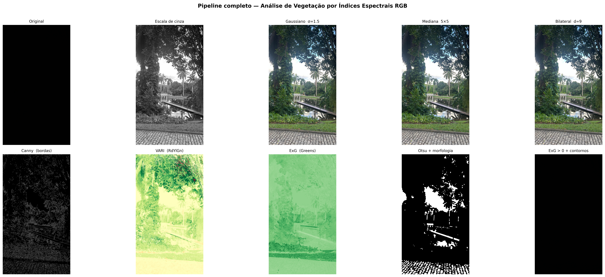

*Grid 2×5 com todos os estágios: original → grayscale → filtros (Gaussiano, Mediana, Bilateral) → Canny → VARI → ExG → segmentação Otsu → segmentação ExG com contornos*

---

## Índices de vegetação implementados

### VARI — Visible Atmospherically Resistant Index

```
VARI = (G − R) / (G + R − B)
```

Desenvolvido por Gitelson et al. (2002). Range teórico −1 a +1: valores positivos indicam vegetação viva, negativos indicam solo, estruturas ou água. Resistente a variações de iluminação atmosférica.

**Implementação:** máscara de luminância exclui pixels de sombra (`(R+G+B)/3 < 0.1`) onde o denominador colapsa para zero, eliminando outliers numéricos sem significado físico.

### ExG — Excess Green Index

```
ExG = 2G − R − B
```

Desenvolvido por Woebbecke et al. (1995). Threshold natural em zero: `ExG > 0` → presença de vegetação. Mais simples que o VARI, altamente eficaz para segmentação direta.

---

## Técnicas implementadas

| Técnica | Detalhes |
|---|---|
| Conversão de espaço de cores | BGR → RGB, escala de cinza, HSV |
| Redimensionamento | 19.9 MP → 1600 px de largura (versão de trabalho) |
| Separação de canais | R, G, B em `float32` normalizado [0, 1] |
| Cálculo de índices espectrais | VARI com máscara de luminância, ExG, ExGR |
| Histogramas | Canais R, G, B individuais + distribuição ExG |
| Filtro Gaussiano | σ = 1.5, PSNR = 33.16 dB |
| Filtro de Mediana | kernel 5×5, PSNR = 32.81 dB |
| Filtro Bilateral | d = 9, σColor = 75, PSNR = 34.08 dB |
| Detecção de bordas (Canny) | 3 pares de limiares comparados (30/90, 50/130, 150/250) |
| Segmentação (Otsu) | limiarização automática por grayscale |
| Segmentação (ExG) | threshold físico fixo em 0.0 |
| Morfologia matemática | `MORPH_OPEN` + `MORPH_CLOSE` (kernel 7×7, 2 iterações) |
| Análise comparativa | pipeline encapsulado aplicado às 2 imagens (2 regimes de cena) |
| Métricas | PSNR, SNR, percentual de área segmentada, valor médio de pixel |

---

## Resultados

### Visualização comparativa dos índices

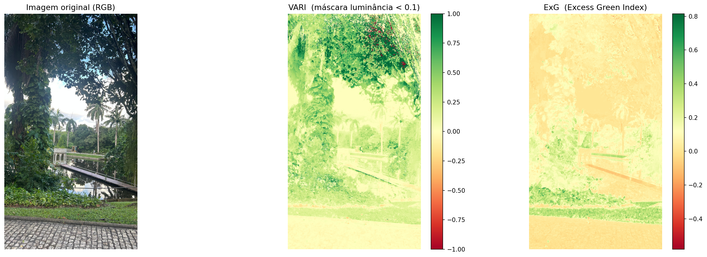

### Comparação de filtros com PSNR

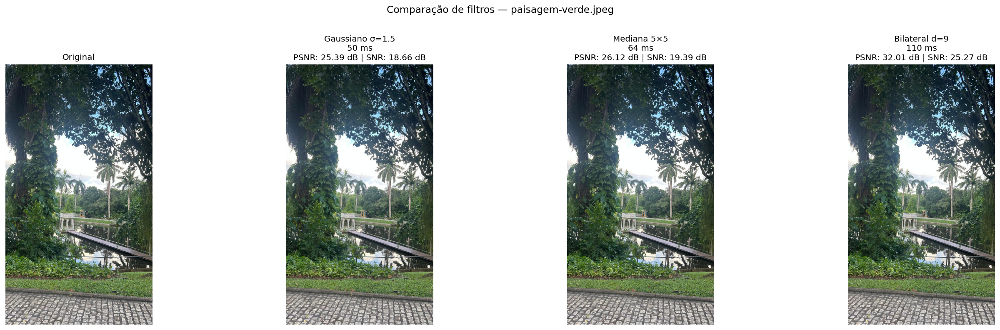

| Filtro | PSNR (dB) | SNR (dB) | Custo relativo |
|---|---|---|---|
| Gaussiano σ=1.5 | 33.16 | 26.06 | 1× |
| Mediana 5×5 | 32.81 | 25.71 | 0.9× |
| Bilateral d=9 | **34.08** | **26.98** | 1.5× |

O **bilateral** apresenta maior PSNR porque preserva bordas — afasta menos a imagem do original mesmo suavizando ruído. Como a imagem aérea tem pouco ruído, os três filtros ficam próximos (32.8–34.1 dB); a **mediana** é a que mais altera a textura fina do campo, ficando com o menor PSNR.

### Detecção de bordas — Canny com discussão dos limiares

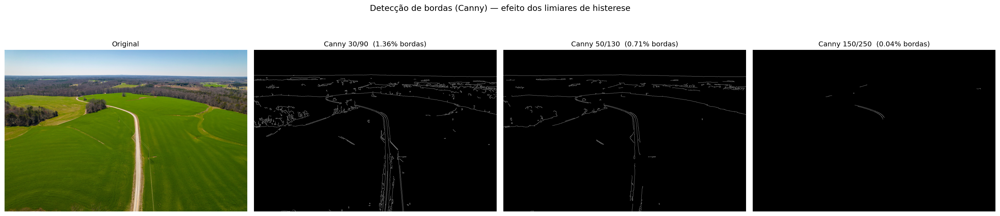

| Limiares (t1/t2) | Pixels de borda | Comportamento |
|---|---|---|
| 30/90 | 1.36% | captura textura fina — ruidoso |
| **50/130 (adotado)** | 0.71% | estrada, horizonte e talhões contínuos |
| 150/250 | 0.04% | só contornos fortes — fragmentado |

### Segmentação: Otsu (grayscale) vs. ExG

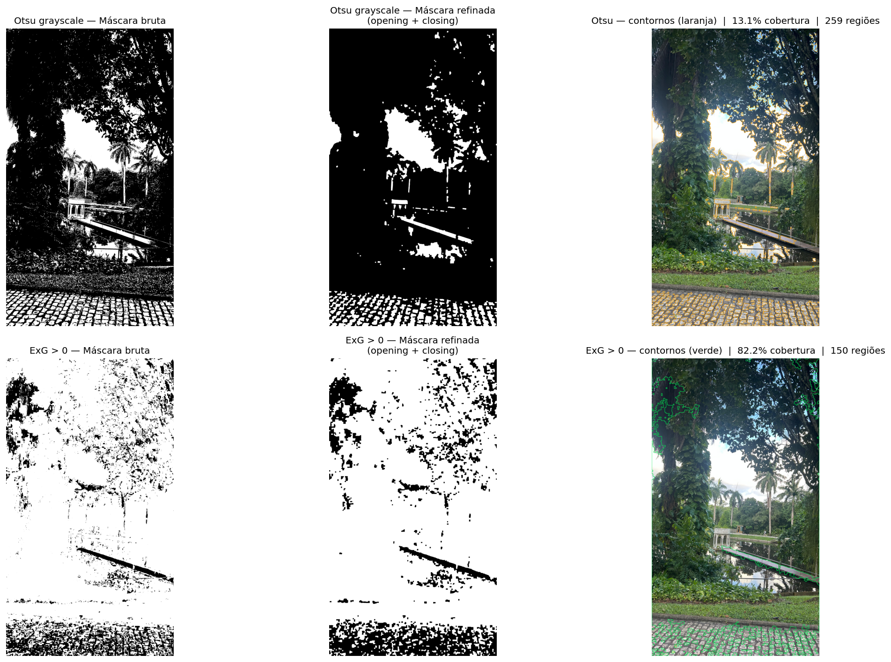

| Método | Threshold | Cobertura | Regiões |
|---|---|---|---|
| Otsu (grayscale) | 0.55 | 17% | 3 |
| ExG > 0 (fixo) | 0.0 | 83% | 14 |

Otsu segmenta por **brilho** — e acaba marcando justamente a **estrada de terra clara** (e o céu), ou seja, *exatamente o que não é vegetação*. ExG segmenta por **assinatura espectral de crominância**, detectando especificamente o campo verde e excluindo estrada e céu.

### Segmentação aprimorada — ExGR + trava HSV

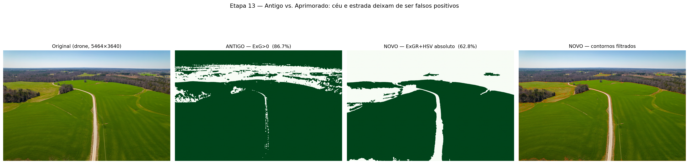

A segmentação `ExG > 0` ingênua produz **falsos positivos**: marca céu, solo claro e superfícies cinzas como vegetação. A versão final combina quatro técnicas com **testes absolutos de cor**:

1. **ExGR = 3G − 2.4R − B** (Meyer & Neto, 2008) — subtrai o excesso de vermelho, separando solo de vegetação
2. **Trava de cor (HSV)** — `H∈[30,95] & S≥40 & V≥30`, rejeita pixels cinza/dessaturados que não são verdes de fato
3. **Preenchimento de buracos** — fecha vazios internos nas regiões de vegetação
4. **Filtro de área mínima** — remove regiões pequenas antes de desenhar contornos

Um pixel só conta como vegetação se `ExGR > 0` **E** passar na trava HSV. Os dois são testes **absolutos** — diferente do Otsu (corte relativo), que em cenas quase totalmente verdes cortaria a própria vegetação, gerando falsos negativos.

| Imagem (drone) | ExG>0 (ingênuo) | ExGR+HSV (final) | Leitura |
|---|---|---|---|
| campo-fazenda | 86.7% | **63.8%** | céu e estrada excluídos |
| lavoura-solo | 97.4% | **40.2%** | solo excluído, cultura verde preservada |

### Análise multi-imagem

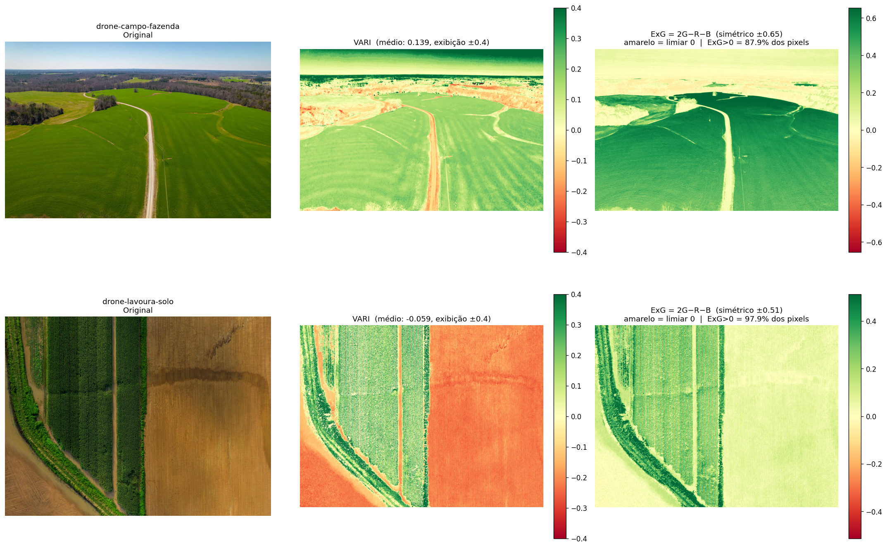

Aplicação do índice ExG (baseline) sobre as 2 imagens — regimes de cena complementares:

| Imagem | Regime de cena | ExG (veg%) | VARI médio | Interpretação |
|---|---|---|---|---|
| drone-campo-fazenda | campo misto (estrada, céu) | 87.85% | +0.1397 | índices concordam — confiável |
| drone-lavoura-solo | lavoura com solo exposto | 97.68% | −0.0695 | **divergem** — ExG superestima solo marrom (corrigido na Etapa 13) |

> Esta tabela usa o ExG ingênuo (`> 0`). A **segmentação aprimorada** (acima) corrige os falsos positivos — `drone-lavoura-solo` cai de 97.68% para 40.2% real (solo excluído, cultura verde preservada graças ao fechamento morfológico aplicado antes da abertura).

### Histogramas

| ExG | Canais R, G, B |
|---|---|
| 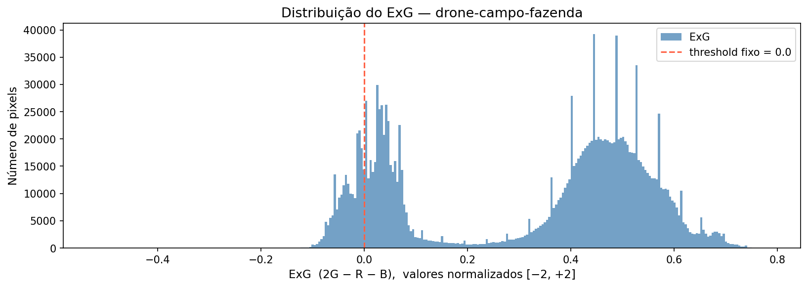 | 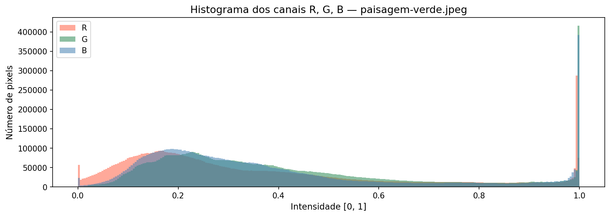 |

### Generalização 1 — setor de petróleo (Etapa 14)

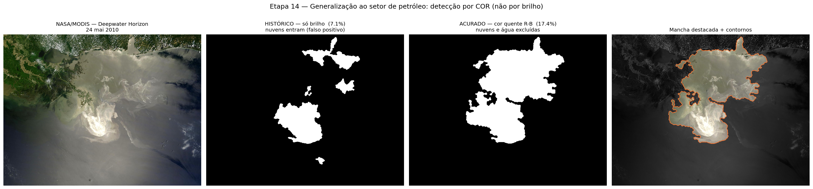

A metodologia **não depende do verde**. Na imagem NASA/MODIS do derramamento da *Deepwater Horizon* (24/05/2010, domínio público), a 1ª versão por **brilho** (`S<60 & V>140`) incluía nuvens (**7.1%**, espalhado). A assinatura real do óleo é a **cor quente (tan)**: `R−B ≈ 20–25` (água e nuvem ≈ 0). Trocando brilho por **temperatura de cor** (`R−B ≥ 14 & V>110 & S<110`) + o mesmo refino morfológico com filtro de área mínima (0,3% da cena) para descartar fragmentos de nuvem, a mancha vira uma **região coerente de 17.4%** — a mesma lição "cor vence brilho" da vegetação.

Aplicações no setor: monitoramento de derrames (este experimento), contornos de vegetação invadindo faixas de dutos (*right-of-way*), e queda de ExG/VARI como alerta precoce de vazamento por estresse vegetal. Limitação: água com sedimento pode confundir-se com óleo fino — a detecção RGB é triagem rápida antes de sensores SAR.

### Generalização 2 — astronomia / contagem de objetos (Etapa 15)

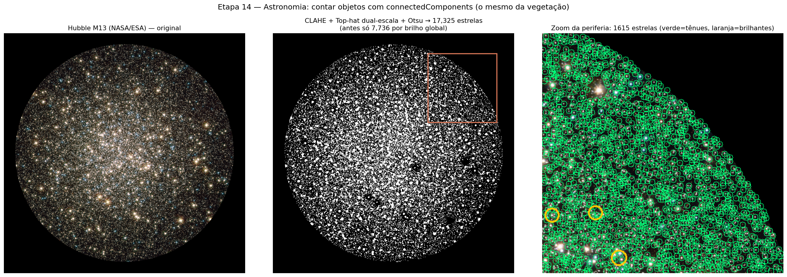

A ideia original do projeto (imagens de telescópio) fecha a demonstração. Na imagem Hubble (NASA/ESA) do aglomerado globular **M13** (domínio público), a assinatura é o **brilho** (estrela = ponto claro no céu negro). O limiar global de brilho perdia as estrelas fracas (7.736); a versão final reusa **três peças do projeto** — **CLAHE** (equalização local de contraste) eleva as estrelas fracas em relação à vizinhança, o **white top-hat** (realce de contraste *local*, primo da equalização) extrai pontos brilhantes do fundo, e o **mesmo Otsu** da vegetação escolhe o corte automático — e o **mesmo** `connectedComponentsWithStats` do filtro de área **conta**: **17.216 estrelas**. Limitação: no núcleo denso as estrelas se fundem, então a contagem é um limite inferior. Os três domínios (vegetação → cobertura %, óleo → área, estrelas → contagem) provam que a contribuição é a **metodologia**.

---

## Estrutura do projeto

```
cv-vegetation-indices/
├── images/                  # imagens de entrada
│   ├── drone-campo-fazenda.jpg       # imagem PRINCIPAL (etapas 1–13), 19.9 MP
│   ├── drone-lavoura-solo.jpg        # caso difícil: solo vs. vegetação, 11.9 MP
│   ├── nasa-deepwater-horizon.jpg    # NASA/MODIS, domínio público (etapa 14)
│   └── hubble-m13-cluster.jpg        # Hubble NASA/ESA, domínio público (etapa 15)
├── notebooks/
│   └── analise_indices_vegetacao.ipynb   # pipeline completo (etapas 1–15)
├── outputs/                 # imagens geradas pelo notebook
│   ├── original_vs_grayscale.png
│   ├── histograma_rgb.png
│   ├── histograma_exg.png
│   ├── comparativo_indices.png
│   ├── segmentacao_exg.png
│   ├── analise_multi_imagem.png
│   ├── comparacao_segmentacao.png
│   ├── comparacao_filtros.png
│   ├── canny_limiares.png
│   ├── grid_pipeline_completo.png
│   ├── segmentacao_aprimorada.png
│   ├── generalizacao_petroleo.png
│   └── generalizacao_estrelas.png
├── artigo/                  # relatório técnico em LaTeX (main.tex, main.pdf, figuras/)
├── site/                    # slides da apresentação (HTML, estilo claro/escuro)
└── README.md
```

---

## Como executar

**Requisitos:** macOS/Linux, Python 3.10+

```bash
# 1. Clonar o repositório
git clone https://github.com/GilbertoPaiva/cv-vegetation-indices.git
cd cv-vegetation-indices

# 2. Criar e ativar ambiente virtual
python3 -m venv .venv
source .venv/bin/activate          # Windows: .venv\Scripts\activate

# 3. Instalar dependências
pip install opencv-python numpy matplotlib pillow scikit-image scipy jupyterlab

# 4. Iniciar Jupyter
jupyter lab
```

Abra `notebooks/analise_indices_vegetacao.ipynb` e execute todas as células em ordem (`Kernel → Restart & Run All`).

---

## Dependências

| Pacote | Versão testada |
|---|---|
| Python | 3.11.9 |
| opencv-python | 4.13.0 |
| numpy | 2.4.4 |
| matplotlib | 3.10.9 |
| pillow | 12.2.0 |
| scikit-image | 0.26.0 |
| scipy | (preenchimento de buracos na Etapa 13) |
| jupyterlab | 4.5.7 |

---

## Referências

- GITELSON, A. A. et al. *Novel algorithms for remote estimation of vegetation fraction*. Remote Sensing of Environment, 2002. — origem do VARI
- WOEBBECKE, D. M. et al. *Color indices for weed identification under various soil, residue, and lighting conditions*. Transactions of the ASAE, 1995. — origem do ExG
- MEYER, G. E.; NETO, J. C. *Verification of color vegetation indices for automated crop imaging applications*. Computers and Electronics in Agriculture, 2008. — origem do ExGR
- GONZALEZ, R. C.; WOODS, R. E. *Processamento Digital de Imagens*. 3. ed. Pearson, 2010.
- BRADSKI, G.; KAEHLER, A. *Learning OpenCV 4*. O'Reilly Media, 2019.
- OpenCV Documentation: https://docs.opencv.org/4.x/
- NumPy Documentation: https://numpy.org/doc/stable/
- scikit-image Documentation: https://scikit-image.org/docs/stable/
